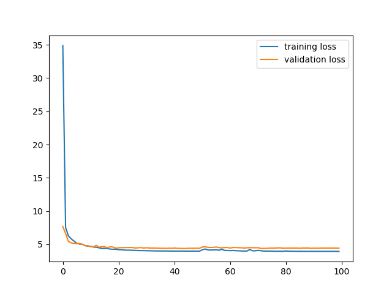
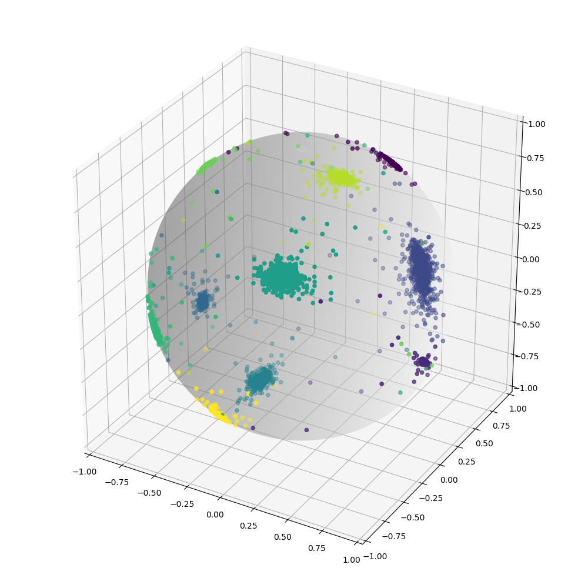

## Project Title

An Pytorch implementation of the paper: H. Wang et al., "CosFace: Large Margin Cosine Loss for Deep Face Recognition," 2018 IEEE/CVF Conference on Computer Vision and Pattern Recognition, Salt Lake City, UT, 2018, pp. 5265-5274.
### Training
```
python train.py
```
Loss during training process



### Testing
```
python test.py
```
Result
